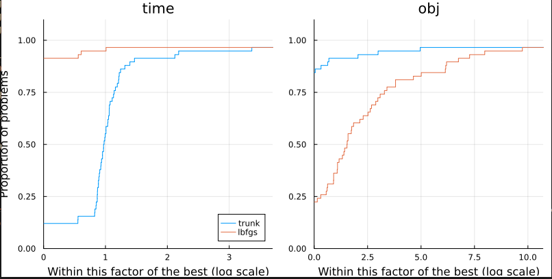

# ADNLPModelProblems Tutorial

```
using ADNLPModelProblems
```

This package provides a problem set in the `ADNLPModel` format defined in [ADNLPModels.jl](https://github.com/JuliaSmoothOptimizers/ADNLPModels.jl). Using [JuliaSmoothOptimizers](https://github.com/JuliaSmoothOptimizers) tools, it is then straightforward to run a benchmark on the problem set and using [DataFrames.jl](https://github.com/JuliaData/DataFrames.jl) tools one can easily select problems.

## How to select problems

This package exports a `DataFrame` called `ADNLPModelProblems.meta` containing all the information regarding the classification of the problems. The `meta` of each problem can be separately obtained by
```
ADNLPModelProblems.arglina_meta # for the problem "arglina"
```

The `ADNLPModelProblems.meta` can be used to select instances. For more information, on data manipulation with [DataFrames.jl](https://github.com/JuliaData/DataFrames.jl) we refer to the [tutorials](https://dataframes.juliadata.org/stable/man/querying_frameworks/) and to the [DataFramesMeta.jl tutorial](https://juliadata.github.io/DataFramesMeta.jl).
```
using DataFramesMeta
# select the columns nvar and name for scalable problems
@linq ADNLPModelProblems.meta |> where(:variable_size) |> select(:nvar, :name)
# select all the columns of problems with linear objective
@linq ADNLPModelProblems.meta |> where(:objtype .== ^(:linear))
```
The scalable problems are parametrized by one parameter whose default value is `ADNLPModelProblems.default_nvar`. To obtain the number of variables and constraints for a given value `n`, use the function `get_nameoftheproblem_meta()` as follows
```
ADNLPModelProblems.get_arglina_meta(n = 10) # return a tuple of integer
```

## How to get the NLPModel

For each instance, one can get the `ADNLPModel` using the function `nameoftheproblem_autodiff()` as follows
```
nlp = ADNLPModelProblems.arglina_autodiff(n = ADNLPModelProblems.default_nvar, type = Val(Float64))
```
For problems that are not scalable, the argument `n` has no impact on the number of variables/constraints.

The package [ADNLPModels.jl](https://github.com/JuliaSmoothOptimizers/ADNLPModels.jl) handles several backend depending on the package used for the automatic differentiation, e.g. ForwardDiffAD, ReverseDiffAD, ZygoteAD respectively for [ForwardDiff.jl](https://github.com/JuliaDiff/ForwardDiff.jl), [ReverseDiff.jl](https://github.com/JuliaDiff/ReverseDiff.jl), and [Zygote.jl](https://github.com/FluxML/Zygote.jl). By default, `nameoftheproblem_autodiff()` will use the default backend from [ADNLPModels.jl](https://github.com/JuliaSmoothOptimizers/ADNLPModels.jl). One can modify this either by specifying the keyword `adbackend` or use one of the shortcut:
```
ADNLPModelProblems.arglina_forward() # ForwardDiff backend
ADNLPModelProblems.arglina_reverse() # ReverseDiff backend
ADNLPModelProblems.arglina_zygote() # Zygote backend
```
Many problems from this repository have a [JuMP](https://jump.dev/JuMP.jl/stable/) correspondence, either from this repository or from [OptimizationProblems.jl](https://github.com/JuliaSmoothOptimizers/OptimizationProblems.jl/)
```
ADNLPModelProblems.arglina_jump() # NLPModelJuMP model
```
The list of problems for which there is no such JuMP model is
```
ADNLPModelProblems.problems_no_jump
```

## Run a benchmark

Using [SolverBenchmark.jl](https://github.com/JuliaSmoothOptimizers/SolverBenchmark.jl) one can easily benchmark solvers. This tutorial compares `lbfgs` and `trunk`, which are two solvers for unconstrained optimization problems available in [JSOSolvers.jl](https://github.com/JuliaSmoothOptimizers/JSOSolvers.jl).
```
using JSOSolvers, SolverBenchmark
# Select unconstrained problems
names = @linq ADNLPModelProblems.meta |> where(:contype .== ^(:unconstrained)) |> select(:name)
# Prepare the list of ADNLPModel
adproblems = (eval(Meta.parse("ADNLPModelProblems.$(pb[:name])_autodiff()")) for pb in eachrow(names))
# Prepare the solvers
solvers = Dict(:lbfgs => nlp -> lbfgs(nlp), :trunk => nlp -> trunk(nlp))
# Use SolverBenchmark to run the solvers on all the instances
stats = bmark_solvers(solvers, adproblems)

# Print the results of each solver in a table
cols = [:id, :name, :nvar, :objective, :dual_feas, :neval_obj, :neval_grad, :neval_hess, :iter, :elapsed_time, :status]
header = Dict(
  :nvar => "n",
  :objective => "f(x)",
  :dual_feas => "‖∇f(x)‖",
  :neval_obj => "# f",
  :neval_grad => "# ∇f",
  :neval_hprod => "# ∇²f v",
  :elapsed_time => "t",
)

for solver ∈ keys(solvers)
  pretty_stats(stats[solver][!, cols], hdr_override=header)
end

# Or compare the performance of both solvers using performance profiles
first_order(df) = df.status .== :first_order
unbounded(df) = df.status .== :unbounded
solved(df) = first_order(df) .| unbounded(df)
costnames = ["time", "obj"]
costs = [df -> .!solved(df) .* Inf .+ df.elapsed_time,
         df -> .!solved(df) .* Inf .+ df.neval_obj]
profile_solvers(stats, costs, costnames)
```

